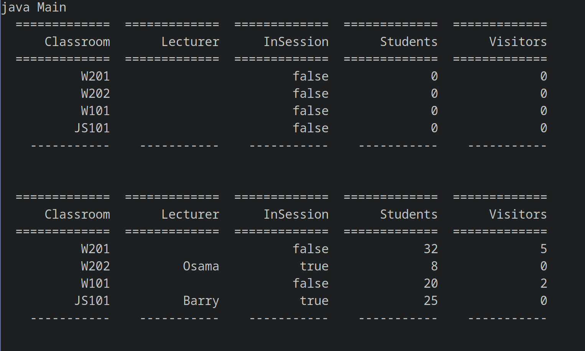

# About
This Project is simulating a college with its classrooms, students, visitors and its lecturers.

# How to Run
    
You can compile the project with:
```  
    $ make   
```  
    
Then you can run the project with:  
```  
    $ make run  
```  
  
# Sample Run
    
